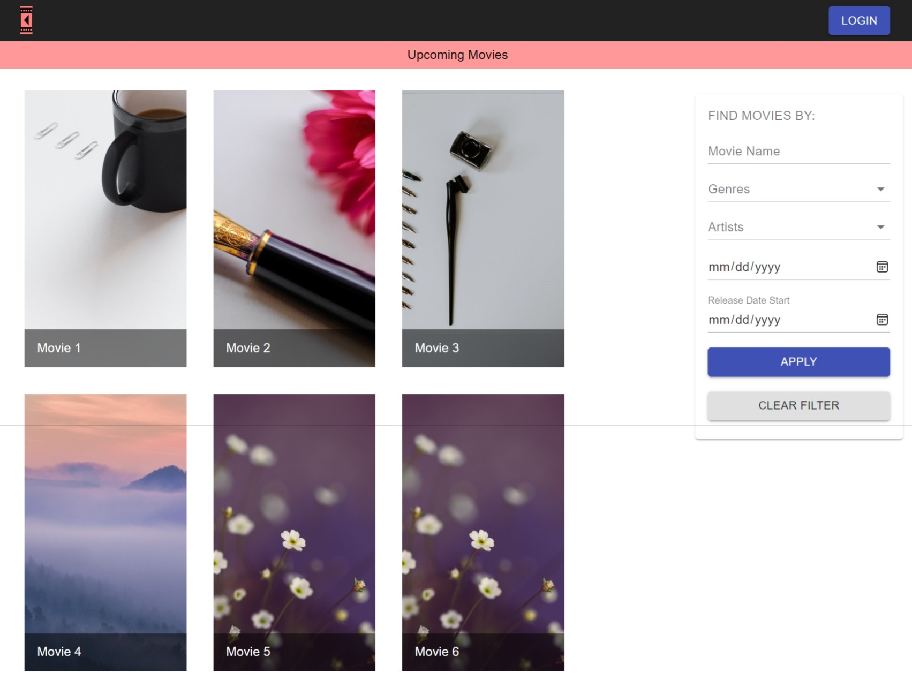

### Movie Application

Project based on **React.js**, it allow users to find latest movie release.

### Pre Requisites

- **Node.js** version **21** or greater.

### Dependencies used by the project

1. **react**.
2. **redux**.
3. **material-ui**.
4. **jest**.

### Available scripts

1. `npm start` for running the application in production environment.

### Required environment variables

1. `domainName` specify the address of the `Task Manager API` in `./src/config`.

### Instructions

1. Visit `http://localhost:3000` in the browser.

2. Home page display different movies with a side bar having different filters. 

3. Click on the movie for getting the information of that specific movie.
